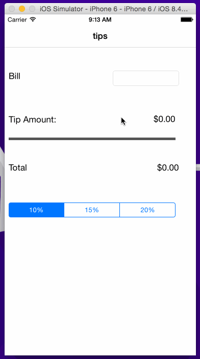

# TipCalculator Demo (Amit Agarwal)

(Sample of your weekly project submission README)

This is an iOS app to calculate tip amount based on the bill amount and tip percentage. See the [Tip Calculator Tutorial](https://vimeo.com/74764846) for a step-by-step tutorial.

Time spent: 3 hours spent in total

Completed user stories:

 * [x] Required: UI for tip calculator app
 * [x] Required: Tip amount calculation on onTap event and on percent change event.

Notes:

GIF created with [LiceCap](http://www.cockos.com/licecap/)
